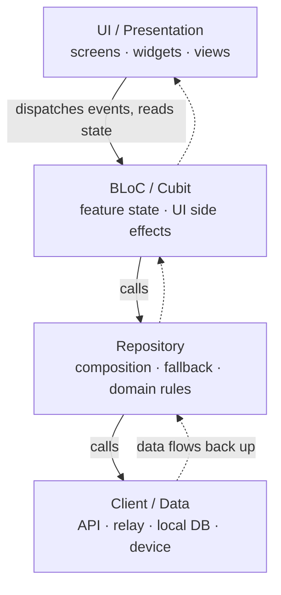

# App Architecture: Layers & Dependency Direction

Status: Current
Validated against: current mobile architecture direction on 2026-07-20.

This is the map a contributor needs to place new code correctly: the app's
layers, the one direction dependencies may point, and how CI enforces it.

**Source of truth:** the full contract — per-layer responsibilities, the
dependency graph, dependency injection, barrel files, and package-extraction
guidance, with worked good/bad examples — lives in
[`.claude/rules/architecture.md`](../.claude/rules/architecture.md). This page
summarizes and links it; it never restates the code examples, so the two cannot
drift. For Nostr SDK internals (the innards of the `Client` layer) see
[docs/NOSTR_SDK_ARCHITECTURE.md](NOSTR_SDK_ARCHITECTURE.md).

## The layered flow

New feature work flows `UI → BLoC/Cubit → Repository → Client`. A layer may only
depend on the layer directly beneath it; data flows back up. Nothing above the
repository decides *where* data comes from.

Solid arrows are the allowed dependency direction; dashed arrows are the data
returning upward.

## What each layer owns

| Layer | Owns | Must **not** |
|-------|------|--------------|
| **UI** (`screens`, `widgets`, `view(s)`) | Building widgets; reading state; dispatching events | Filtering, sorting, conditional fetching, retry/fallback; importing `services/` directly (go through a BLoC/Cubit) |
| **BLoC / Cubit** | Feature UI state; loading/success/failure status; UI side effects | Depending on another BLoC; depending on Flutter UI types; holding mutable instance fields; storing error strings/exceptions in state (use status enums + `addError`) |
| **Repository** | Composing one or more clients; applying domain rules; **owning fallback and source-selection** between sources | Importing Flutter; depending on another repository |
| **Client** | Retrieving raw data from one external source (REST API, relay, local DB, device) | Feature/domain logic; choosing between sources |

## The rule people miss: the repository owns fallback

When data can come from more than one source — try the API, fall back to a relay
or local cache — **the repository decides the strategy.** BLoCs and UI never
implement source-selection or fallback logic; a widget doing more than reading
state and dispatching events is a layering violation. See
[`.claude/rules/architecture.md`](../.claude/rules/architecture.md) for the
worked good/bad examples.

State management specifics (BLoC-first for new UI; Riverpod is legacy migration
glue) live in [docs/STATE_MANAGEMENT.md](STATE_MANAGEMENT.md) and the migration
policy in [docs/BLOC_UI_MIGRATION_PRD.md](BLOC_UI_MIGRATION_PRD.md).

## How CI enforces it

Three scripts under `mobile/scripts/` guard these boundaries. They are **not the
same kind of check**, and all three run **only in CI** — in the `Generated
Files` job of
[`.github/workflows/mobile_ci.yaml`](../.github/workflows/mobile_ci.yaml) — so a
local `--no-verify` or a machine without the git hooks installed is caught only
on the PR.

| Script | Guards | Kind |
|--------|--------|------|
| [`check_ui_service_boundary.sh`](../mobile/scripts/check_ui_service_boundary.sh) | A UI-layer file (`mobile/lib/**/{screens,widgets,view,views}/**`) importing the service layer directly, bypassing BLoC/Cubit | **Shrink-only baseline ratchet** vs `origin/main` — the allowed set is frozen in [`mobile/scripts/baseline/ui_service_imports.txt`](../mobile/scripts/baseline/ui_service_imports.txt) and may only shrink; regenerate after fixing a file with `UPDATE_BASELINE=1 bash mobile/scripts/check_ui_service_boundary.sh` |
| [`check_riverpod_boundary.sh`](../mobile/scripts/check_riverpod_boundary.sh) | A new `@riverpod`/`@Riverpod(` annotation or `StateProvider(` in `mobile/lib/` outside the allowed provider directories | Hardcoded directory-exclude guard — **no baseline file** |
| [`check_changenotifier_boundary.sh`](../mobile/scripts/check_changenotifier_boundary.sh) | A new `ChangeNotifier` subclass (`extends`/`with`) in `mobile/lib/` outside the sanctioned allowlist | Hardcoded allowlist guard — **no baseline file**; adding a sanctioned class requires editing both the script's allowlist and the "Sanctioned Riverpod (STAYS)" table in [docs/BLOC_UI_MIGRATION_PRD.md](BLOC_UI_MIGRATION_PRD.md) |

The riverpod and changenotifier guards scan `mobile/lib/` only (packages are out
of scope); the ui-service guard is further narrowed to the presentation
subtrees. The full ratchet policy is in
[docs/BLOC_UI_MIGRATION_PRD.md](BLOC_UI_MIGRATION_PRD.md).

## Go deeper

- [`.claude/rules/architecture.md`](../.claude/rules/architecture.md) — the full contract (per-layer responsibilities, dependency graph, DI, barrel files, when to extract a package). **Source of truth.**
- [docs/BLOC_UI_MIGRATION_PRD.md](BLOC_UI_MIGRATION_PRD.md) — Riverpod→BLoC migration policy and the CI ratchet reference.
- [docs/STATE_MANAGEMENT.md](STATE_MANAGEMENT.md) — current state-management direction.
- [docs/NOSTR_SDK_ARCHITECTURE.md](NOSTR_SDK_ARCHITECTURE.md) — Nostr SDK internals (the `Client` layer's innards).
