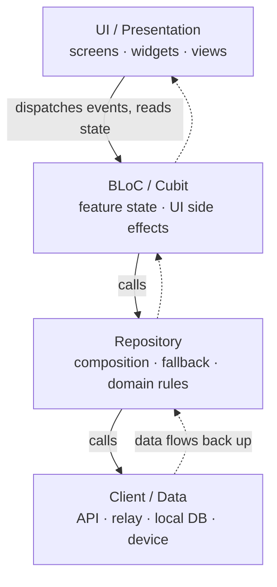

# App Architecture: Layers & Dependency Direction

Status: Current
Validated against: current mobile architecture direction on 2026-07-20.

This is the map a contributor needs to place new code correctly: the app's
layers, the one direction dependencies may point, and how CI enforces it.

**Source of truth:** the full contract — per-layer responsibilities, the
dependency graph, dependency injection, barrel files, and package-extraction
guidance, with worked good/bad examples — lives in
[`.claude/rules/architecture.md`](../.claude/rules/architecture.md). This page
summarizes and links it; it never restates the code examples, so the two cannot
drift. For Nostr SDK internals (the innards of the `Client` layer) see
[docs/NOSTR_SDK_ARCHITECTURE.md](NOSTR_SDK_ARCHITECTURE.md).

## The layered flow

New feature work flows `UI → BLoC/Cubit → Repository → Client`. A layer may only
depend on the layer directly beneath it; data flows back up. Nothing above the
repository decides *where* data comes from.



Solid arrows are the allowed dependency direction; dashed arrows are the data
returning upward.

## What each layer owns

| Layer | Owns | Must **not** |
|-------|------|--------------|
| **UI** (`screens`, `widgets`, `view(s)`) | Building widgets; reading state; dispatching events | Filtering, sorting, conditional fetching, retry/fallback; importing `services/` directly (go through a BLoC/Cubit) |
| **BLoC / Cubit** | Feature UI state; loading/success/failure status; UI side effects | Depending on another BLoC; depending on Flutter UI types; holding mutable instance fields; storing error strings/exceptions in state (use status enums + `addError`) |
| **Repository** | Composing one or more clients; applying domain rules; **owning fallback and source-selection** between sources | Importing Flutter; depending on another repository |
| **Client** | Retrieving raw data from one external source (REST API, relay, local DB, device) | Feature/domain logic; choosing between sources |

## The rule people miss: the repository owns fallback

When data can come from more than one source — try the API, fall back to a relay
or local cache — **the repository decides the strategy.** BLoCs and UI never
implement source-selection or fallback logic; a widget doing more than reading
state and dispatching events is a layering violation. See
[`.claude/rules/architecture.md`](../.claude/rules/architecture.md) for the
worked good/bad examples.

State management specifics (BLoC-first for new UI; Riverpod is legacy migration
glue) live in [docs/STATE_MANAGEMENT.md](STATE_MANAGEMENT.md) and the migration
policy in [docs/BLOC_UI_MIGRATION_PRD.md](BLOC_UI_MIGRATION_PRD.md).

## How CI enforces it

Three scripts under `mobile/scripts/` guard these boundaries. They are **not the
same kind of check**, and all three run **only in CI** — in the `Generated
Files` job of
[`.github/workflows/mobile_ci.yaml`](../.github/workflows/mobile_ci.yaml) — so a
local `--no-verify` or a machine without the git hooks installed is caught only
on the PR.

| Script | Guards | Kind |
|--------|--------|------|
| [`check_ui_service_boundary.sh`](../mobile/scripts/check_ui_service_boundary.sh) | A UI-layer file (`mobile/lib/**/{screens,widgets,view,views}/**`) importing the service layer directly, bypassing BLoC/Cubit | **Shrink-only baseline ratchet** vs `origin/main` — the allowed set is frozen in [`mobile/scripts/baseline/ui_service_imports.txt`](../mobile/scripts/baseline/ui_service_imports.txt) and may only shrink; regenerate after fixing a file with `UPDATE_BASELINE=1 bash mobile/scripts/check_ui_service_boundary.sh` |
| [`check_riverpod_boundary.sh`](../mobile/scripts/check_riverpod_boundary.sh) | A new `@riverpod`/`@Riverpod(` annotation or `StateProvider(` in `mobile/lib/` outside the allowed provider directories | Hardcoded directory-exclude guard — **no baseline file** |
| [`check_changenotifier_boundary.sh`](../mobile/scripts/check_changenotifier_boundary.sh) | A new `ChangeNotifier` subclass (`extends`/`with`) in `mobile/lib/` outside the sanctioned allowlist | Hardcoded allowlist guard — **no baseline file**; adding a sanctioned class requires editing both the script's allowlist and the "Sanctioned Riverpod (STAYS)" table in [docs/BLOC_UI_MIGRATION_PRD.md](BLOC_UI_MIGRATION_PRD.md) |

The riverpod and changenotifier guards scan `mobile/lib/` only (packages are out
of scope); the ui-service guard is further narrowed to the presentation
subtrees. The full ratchet policy is in
[docs/BLOC_UI_MIGRATION_PRD.md](BLOC_UI_MIGRATION_PRD.md).

### Which packages may depend on Flutter (issue #3338)

A package under `mobile/packages/` may declare a runtime Flutter SDK
dependency when it is one of:

- a **native plugin** — it ships a `flutter: plugin:` block and talks over a
  `MethodChannel` (`background_uploader`, `caption_generator`,
  `divine_quick_actions`, `image_metadata_stripper`), or wraps one
  (`keycast_flutter`, `nostr_key_manager`, `media_cache`,
  `permissions_service`, `sound_service`);
- a **presentation-layer package** — it exports widgets (`divine_ui`,
  `infinite_video_feed`, `tv_static_effect`, plus `divine_camera` and
  `divine_video_player`, which are both plugin and widget);
- a consumer of a **Flutter-only API with no pure-Dart substitute** —
  `unified_logger` (`kDebugMode`/`kIsWeb`/`debugPrint`), `blurhash_service`
  (`dart:ui` — `ui.Image`, `ui.Color`), `iap_repository`
  (`defaultTargetPlatform`), `analytics` (`NavigatorObserver`,
  `WidgetsBinding`), `nostr_sdk` (Android NIP-55 external signer).

Anything else is out of policy, and **CI enforces it**:
`mobile/scripts/check_package_flutter_boundary.sh` freezes the set in
`mobile/scripts/baseline/package_flutter_deps.txt` (shrink-only — a package
re-adding the entry fails the `generated-files` job). That baseline, not this
page, is the machine-checked list; each entry carries a reason naming the
concrete Flutter surface it uses. Regenerate only after *removing* a
dependency:

```bash
UPDATE_BASELINE=1 bash mobile/scripts/check_package_flutter_boundary.sh
```

`flutter_test` under `dev_dependencies:` is **not** counted — test-only Flutter
is fine, and 15 of the 37 packages with no runtime Flutter dependency already
ship exactly that shape.

`dm_repository` used to be in the API group and no longer is: it needed only
`compute` and `kReleaseMode`, both now pure-Dart shims in its own `lib/src/`
(`compute.dart` ports Flutter's implementation, conditional import and all;
`build_mode.dart` reuses Flutter's exact `kReleaseMode` definition so the
`_classifyDiagnostics` const still folds away under AOT product mode). That is
the worked example for the rest of the group. `unified_logger` is the next
candidate — it needs an injected console sink, since `debugPrint`'s throttling
has no drop-in replacement. The others are genuinely bound: `dart:ui`,
`defaultTargetPlatform`, and `NavigatorObserver` have no pure-Dart substitute
at all. None of these decouples anything at runtime while `nostr_sdk` is still
in the way, which is the second point below.

Two things are worth knowing before doing more of this work:

- **Removing a `flutter: sdk: flutter` entry changes nothing at build time,
  but it is not cosmetic — it turns the boundary into a gate.** Nothing about
  the build moves: `pubspec.lock` is bit-identical across the removal, and no
  native plugin is deregistered (`flutter` has no `plugin:` key, so it is
  never a plugin). What changes is what the package is *allowed to import*.
  Every package under `mobile/packages/` includes `very_good_analysis`, which
  enables `depend_on_referenced_packages`; with the entry gone, a
  `package:flutter/...` import anywhere in that package's `lib/` becomes an
  analyze failure, and each package's own CI workflow runs `flutter analyze`.
  So re-opening the boundary costs a pubspec edit that shows up in review,
  rather than an import nobody notices. (A package with no workflow of its
  own would get the local guard but no CI gate; as of #3347 every package
  under `mobile/packages/` carries one.)
- **No package in the `nostr_sdk` cone can run under `dart test`.** `nostr_sdk`
  declares the Flutter SDK and five Flutter plugins, and nearly every package
  reaches it — `models` included, via `models -> nostr_sdk`. So a package with
  no `flutter:` line is still not a pure-Dart package. Making that true
  requires splitting `nostr_sdk`'s Android NIP-55 signer (4 files, 735 LOC)
  into a Flutter-side shim, which is tracked as the #3338 follow-up epic.

## Go deeper

- [`.claude/rules/architecture.md`](../.claude/rules/architecture.md) — the full contract (per-layer responsibilities, dependency graph, DI, barrel files, when to extract a package). **Source of truth.**
- [docs/BLOC_UI_MIGRATION_PRD.md](BLOC_UI_MIGRATION_PRD.md) — Riverpod→BLoC migration policy and the CI ratchet reference.
- [docs/STATE_MANAGEMENT.md](STATE_MANAGEMENT.md) — current state-management direction.
- [docs/NOSTR_SDK_ARCHITECTURE.md](NOSTR_SDK_ARCHITECTURE.md) — Nostr SDK internals (the `Client` layer's innards).
